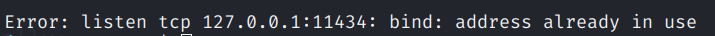

# Agent Fundamentals

## Running Models Locally with Ollama

Here are some steps to follow:

1. Install Ollama:

    As of the writing of this post, you can download Ollama on linux using the following command:

    `curl -fsSL https://ollama.com/install.sh | sh`

    Otherwise, you can download Ollama [on their official site](https://ollama.com/download)

2. Pull a model locally:

    Proceed to [ollama website](https://ollama.com/search) and select one model you can pull locally. In my case, I chose gemma3n.

    To pull the model locally, run:

    `ollama pull gemma3n`

3. Start Ollama in the background:

    On your terminal, run:

    `ollama serve`

    If you run into an error as shown below:
    

    Use the command `sudo lsof -i :11434` to identify the process ID (PID) currently using this port. If the process is `ollama`, the installation script we used above has likely started ollama service.

    ---

    === "Windows"
        ```sh
            pip install mkdocs-material
        ```

    === "Linux"
        ```sh
            source venv/bin/activate
        ```

4. sjjfjf