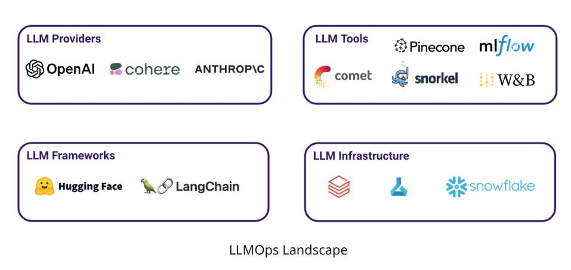
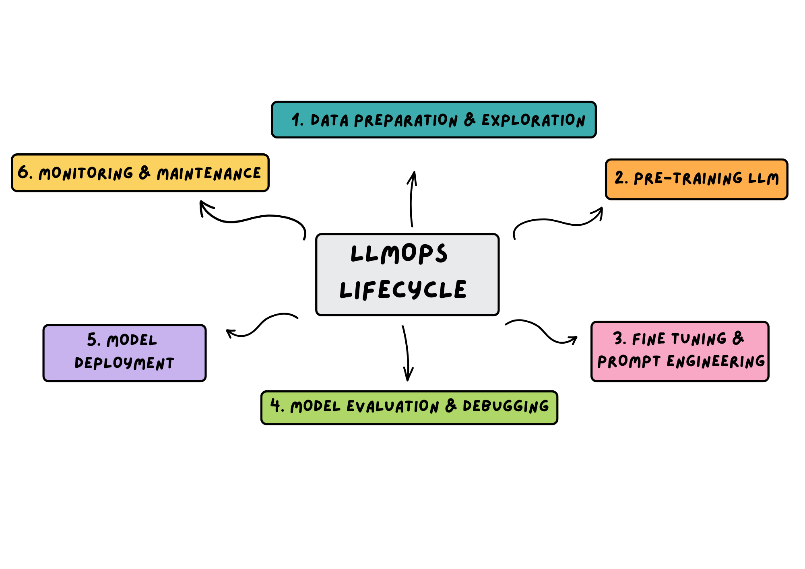

# Large Language Model Operations (LLMOps)

Learn more about LLMOps and its role building AI applications.

??? Overview

    Documenting concepts learnt from [Udacity's LLMOps course](https://www.udacity.com/course/building-real-world-applications-with-large-language-models--cd13455)

## Definition - Large Language Model (LLM)
An [LLM](https://ask.library.arizona.edu/faq/407985) is an AI system that is trained on a lot of language data (often times trillions of tokens).

An LLM is capable of performing various language tasks including:

- Engaging in natural language conversations.
- Information extraction.

When developing applications that leverage LLMS, you need to:

- Test, analyze and debug models
- Implement the right infrastructure
- Incorporate the best tools to maximize app performance

Working with LLMs requires that you work with a lot of data (in the case of [Fine Tuning](https://cohere.com/blog/fine-tuning)), lots of compute and have prompt engineering expertise.

This is where LLMOps comes in.

LLMOps refers to the best practices, techniques and tools for operationalizing LLMs in production environment.

With LLMOps, you can apply best practices when building, deploying and maintaining LLMs.

## Overview of LLMOps Landscape

 [Source: Udacity](https://www.udacity.com/course/building-real-world-applications-with-large-language-models--cd13455)

## LLMOps Lifecycle

Below is an overview of the 6 steps that form the LLMOps Lifecycle.

## Benefits of LLMOps

LLMOps strategies help to counter some of the challenges of working with LLMs including:

- Addressing catastrophic failures through monitoring and maintenance.
- Reducing time and cost by streamlining the process of building and deploying LLMs.
- Managing, scaling and mainitaining LLMs.
- Improving performance and reliability of LLMs.

## References

1. [LLMOps: Building Real-World Applications With Large Language Models](https://www.udacity.com/course/building-real-world-applications-with-large-language-models--cd13455)
2. [What is a large language model (LLM)? - University of Arizona Libraries](https://ask.library.arizona.edu/faq/407985)
3. [What is fine-tuning? A guide to fine-tuning LLMs](https://cohere.com/blog/fine-tuning)
