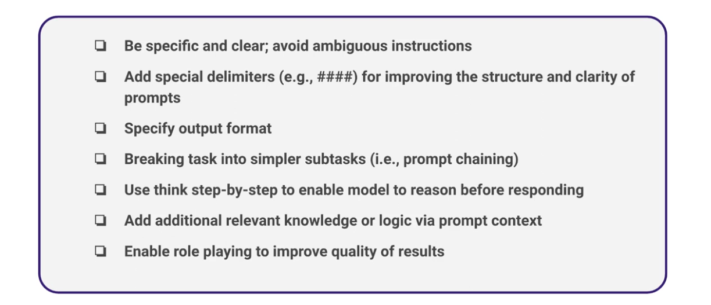

# Prompt Engineering

[Prompt Engineering](https://cloud.google.com/discover/what-is-prompt-engineering) refers to the practice of designing/crefting effective prompts to improve the reliability and accuracy of AI models.

Prompts enable AI models to:

- Understand intent
- Follow instructions
- Generate desired outputs

Additionally, Prompt Engineering helps you optimize prompts in order to control an LLMs output.

Crafting a good prompt is the difference between a reliable and an unreliable model. But what metrics define a good prompt? 

## Defining Prompts

Below are a few tips on crafting concise prompts to improve AI model accuracy.

[Source: Udacity](https://www.udacity.com/course/building-real-world-applications-with-large-language-models--cd13455)

## Prompting Techniques

### Zero-shot Prompting

### Few-shot In-context Learning

- You give the model high-quality demonstrations to guide it.

### ReAct

- LLMs make use of external knowldege and tools to improve output and reduce hallucination.

### Chain-of-thought (CoT)

- If you want the model to take time to reason.

### Prompt Chaining

- Chain several prompts

### Tree of thoughts

### Retrieval Augmented Generation (RAG)

- Leverage external knowledge to omptimize the context of prompts

## References

1. [Prompt Engineering for AI Guide | Google Cloud](https://cloud.google.com/discover/what-is-prompt-engineering)
2. [LLMOps: Building Real-World Applications With Large Language Models](https://www.udacity.com/course/building-real-world-applications-with-large-language-models--cd13455)
